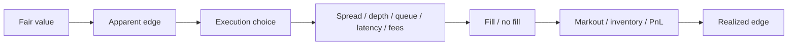

# polymarket_fair_value_engine

`polymarket_fair_value_engine` traces a binary-market idea from probabilistic fair value to executable edge. It separates model edge from the execution process that determines whether that edge survives spread, depth, queue uncertainty, latency, fees, inventory, and adverse selection.

The implemented scope is deliberately narrow:

- the execution-research path is a deterministic binary CLOB replay around supplied fair values
- the football path is an offline probability, fair-value, replay, and calibration case study
- BTC 5-minute up/down is the only end-to-end paper/live-capable path

## Research Pipeline



The core research question is not whether a model produces a favorable discrepancy in isolation. It is how much of that discrepancy remains after the order is selected, submitted, exposed to the book, filled or not filled, charged fees, and marked forward.

## Quick Start

Install the package and regenerate the execution-research reference pack from the bundled input and configuration:

```bash
python -m pip install -e ".[dev]"
python scripts/refresh_execution_research.py
```

The canonical refresh writes the deterministic execution pack under `docs/sample_outputs/execution_research_reference/`, copies the execution casebook, and runs the committed-artifact verifier.

### 60-Second Path

1. Read the [execution report](docs/sample_outputs/execution_research_reference/execution_report.md).
2. Inspect [execution attribution](docs/sample_outputs/execution_research_reference/execution_attribution.csv) for raw model edge, execution cost, fill ratio, fees, latency impact, and net realized edge.
3. Trace the [execution casebook](docs/execution_casebook.md) for concrete lifecycle, no-fill, risk, and markout examples.

The execution harness consumes `fair_yes` as an input. It does not calibrate the fair value model; the football path is the separate offline probability and calibration workflow.

## Model Edge To Realized Edge

The execution reference pack keeps the major quantities separate:

- `raw_model_edge` is the directional fair-value difference versus the decision midpoint.
- `spread_paid_or_captured` measures the directional difference between the fill-time midpoint and execution price.
- `latency_mid_impact` is the signed midpoint move from decision to fill; positive values indicate movement against the selected side.
- `queue_depth_adjustment` is the filled/requested quantity ratio under the visible-depth proxy.
- `net_realized_edge` is the directional fair-value difference at execution after the fill fee.
- `markout_1`, `markout_3`, and `markout_5` are signed future midpoint changes from the fill price at the configured horizons.

These measurements answer different questions. A positive fair-to-fill discrepancy can coexist with a negative post-fill markout, a partial fill, or no fill. The [attribution CSV](docs/sample_outputs/execution_research_reference/execution_attribution.csv) and [markout slices](docs/sample_outputs/execution_research_reference/execution_markout_slices.csv) expose those paths separately.

## Passive And Aggressive Execution

The reference pack compares passive and aggressive styles under conservative, base, and aggressive visible-depth assumptions. Passive execution can capture spread but depends on queue-ahead, participation, expiry, and cancel/fill races. Aggressive execution increases participation and pays the opposing quote, so the apparent edge must survive spread and fee assumptions.

The [profile results](docs/sample_outputs/execution_research_reference/execution_profile_results.csv) show the trade-off on the fixed replay. The [experiment matrix](docs/sample_outputs/execution_research_reference/execution_experiment_matrix.csv) varies one execution assumption at a time, including fair-value edge, spread, imbalance, visible depth, queue-ahead, participation, latency, inventory, and fees. These are sensitivity results for a deterministic fixture, not a universal execution rule.

## Lifecycle And Accounting

The execution layer treats order state as part of the measurement. Invalid, stale, crossed, malformed, expired, or discontinuous market frames fail closed and cannot submit a new order. Valid scenarios record submit, acknowledgement, resting, partial or full fill, cancel request, cancel acknowledgement, expiry, rejection, and cancel/fill race events.

The [lifecycle events](docs/sample_outputs/execution_research_reference/execution_lifecycle_events.csv), [fills](docs/sample_outputs/execution_research_reference/execution_fills.csv), and [account snapshots](docs/sample_outputs/execution_research_reference/execution_account.csv) connect those events to fees, inventory, realized and unrealized PnL, and marked PnL. The [casebook](docs/execution_casebook.md) follows the same path from book state to outcome instead of treating a final PnL number as the whole evaluation.

## Football Research Path

Football is a separate offline fair-value and evaluation case study. It de-vigs bookmaker 1X2 odds, forms a simple consensus, maps that probability into binary football markets, applies book-quality and match-state no-trade rules, and compares strategy configurations on a fixed replay sample. It does not implement live football trading, and its replay fills have no queue-position realism.

### Football Sample At A Glance

| Metric | Committed value |
| --- | --- |
| Fixtures in snapshot sample | 4 |
| Markets priced in snapshot sample | 12 |
| Positive edge markets in snapshot sample | 5 |
| Priced replay snapshots | 64 |
| Quoteable replay snapshots under baseline | 17 |
| Sweep winner | `more_aggressive` |

Start with the [football sample-output index](docs/sample_outputs/README.md). The direct reference packs are:

- [snapshot reference](docs/sample_outputs/football_demo_reference/README.md)
- [replay reference](docs/sample_outputs/football_replay_reference/README.md)
- [strategy sweep reference](docs/sample_outputs/football_sweep_reference/README.md)

## Football Reviewer Path

The football path is easiest to inspect through the index and its zero-click reference packs rather than generated `runs/<run_id>/` directories.

1. Open the [football research dashboard](docs/football_research_dashboard.md).
2. Read the [football trading research note](docs/football_trading_research_note.md).
3. Inspect the [replay report](docs/sample_outputs/football_replay_reference/football_report.md).
4. Read the [decision casebook](docs/football_decision_casebook.md) for fair-value, no-trade, replay, and strategy examples.
5. Read the [strategy configuration note](docs/football_strategy_configuration_note.md) for the tuned policy surface.

The [sample-output index](docs/sample_outputs/README.md) routes to the remaining post-trade and match-state notes without putting every football artifact on the first screen.

## Football Research Notes

- [football research dashboard](docs/football_research_dashboard.md)
- [football trading research note](docs/football_trading_research_note.md)
- [football decision casebook](docs/football_decision_casebook.md)
- [football strategy configuration note](docs/football_strategy_configuration_note.md)
- [football post-trade analysis note](docs/football_post_trade_analysis_note.md)
- [football match-state reaction note](docs/football_match_state_reaction_note.md)

## Regeneration Commands

The football packs are generated from bundled sample inputs. Football remains offline-only, and BTC remains the only end-to-end paper/live path.

```bash
python scripts/refresh_sample_outputs.py
pmfe football-demo --input data/sample_football_markets.json --run-id football-demo-reference
pmfe football-replay --sample --config configs/football_strategy_baseline.json --run-id football-replay-reference
pmfe football-sweep --sample --config configs/football_sweep.json --run-id football-sweep-reference
```

The [football replay walkthrough](docs/football_replay_walkthrough.md) explains state-aware evaluation and the [strategy sweep walkthrough](docs/football_strategy_sweep_walkthrough.md) explains configuration comparison.

## BTC Execution Sandbox

BTC 5-minute up/down remains the only end-to-end paper/live implementation. The default path is paper mode and runs fully offline against `data/sample_replay.jsonl`:

```bash
pmfe demo
```

The explicit forms are:

```bash
pmfe backtest --sample --run-id sample-demo
pmfe report --run-id sample-demo
```

The convenience wrappers at `scripts/demo.sh` and `scripts/demo.ps1` install the editable package, run tests, execute the sample backtest, run the report, and print the output directory. The canonical interface remains `pmfe ...`.

## Reproducibility

Execution research is regenerated with:

```bash
python scripts/refresh_execution_research.py
```

It uses `data/sample_execution_replay.jsonl` and `configs/execution_research.json`, writes the reference pack, and binds `code_version`, `config_sha256`, `input_sha256`, and per-artifact SHA-256 values into `summary.json`. The football refresh uses the commands above and the bundled football inputs under `data/`.

Temporary runs from the CLI write to `runs/<run_id>/`. The sample-output packs under `docs/sample_outputs/` are the inspectable reference copies generated from those inputs; their numerical contents are not live-feed claims.

## Output Artifacts

The execution-research CLI writes:

```text
runs/<run_id>/
  summary.json
  execution_replay_validity.csv
  execution_decisions.csv
  execution_orders.csv
  execution_lifecycle_events.csv
  execution_fills.csv
  execution_markouts.csv
  execution_attribution.csv
  execution_markout_slices.csv
  execution_account.csv
  execution_profile_results.csv
  execution_experiment_matrix.csv
  execution_report.md
  execution_casebook.md
```

The football commands write their pricing, replay, and strategy-sweep CSV/JSON/Markdown artifacts under the same run directory. The [sample-output index](docs/sample_outputs/README.md) lists the committed football and execution packs.

## Architecture

```text
Data -> Model -> Strategy -> Risk -> Order Manager -> Execution -> Reporting
```

- `Data`: market discovery, order books, reference prices, and replay inputs
- `Model`: baseline fair-value estimate for `P(YES)` or supplied football probabilities
- `Strategy`: passive YES / NO quote intents or football candidate quote decisions
- `Risk`: market, gross, series, position, and open-order limits
- `Order Manager`: reconcile desired quotes against current open orders
- `Execution`: paper/live BTC fills or offline football evaluation up to quote decisions and markouts
- `Reporting`: CSV artifacts and JSON summaries under `runs/<run_id>/`

## Live Execution Guardrails

The live adapter is present but deliberately guarded:

- paper mode is the default
- `--live` and `--ack-live-risk` are required
- `PMFE_LIVE_ENABLED=1` must be set
- authentication and configuration failures raise loudly
- `cancel-all` remains the explicit kill-switch path

These guardrails apply to BTC. Live football execution is not implemented.

## Repository Layout

```text
src/polymarket_fair_value_engine/
  cli.py                 # scan / quote / backtest / demo / football-* / execution-research / report / cancel-all
  config.py              # env and runtime config
  data/                  # Gamma, CLOB REST, external prices
  markets/               # market discovery and normalization
  models/                # fair-value models
  strategy/              # passive quoting logic
  risk/                  # exposure and order limits
  execution/             # paper and live execution paths
  analytics/             # exports and run summaries
  backtest/              # replay loader and simulator
  execution_research/    # deterministic CLOB execution replay and evaluation
  sports/                # offline football pricing and sports helpers

legacy/
  polymarket_bot.py      # archived single-file prototype

configs/
  football_strategy_baseline.json
  football_sweep.json

scripts/
  demo.sh
  demo.ps1
```

## Install

Editable install with tests:

```bash
python -m pip install -e ".[dev]"
```

For the optional live dependency:

```bash
python -m pip install -e ".[dev,live]"
```

## Limitations

- the BTC fair-value model is a baseline, not a claim of persistent alpha
- public Polymarket and Coinbase endpoints can be noisy or wide for short-dated binaries
- the paper fill model is intentionally simple and has no queue-position or hidden-liquidity realism
- visible-depth depletion in execution replay is a queue proxy, not participant-level historical FIFO
- execution replay uses a fixed synthetic fixture with no holdout or production validation
- live order management only knows about orders placed by the current running process
- websocket ingestion is still scaffolding
- football fair value comes from bundled bookmaker snapshots rather than an independent in-play model
- football is an offline pricing, replay, and strategy-comparison workflow only
- live football trading is not implemented

## Deeper Docs

- [design note](docs/design.md)
- [execution research packet](docs/execution_research_packet.md)
- [execution casebook](docs/execution_casebook.md)
- [execution reference pack](docs/sample_outputs/execution_research_reference/README.md)
- [football sample-output index](docs/sample_outputs/README.md)
- [football replay walkthrough](docs/football_replay_walkthrough.md)
- [football strategy sweep walkthrough](docs/football_strategy_sweep_walkthrough.md)
